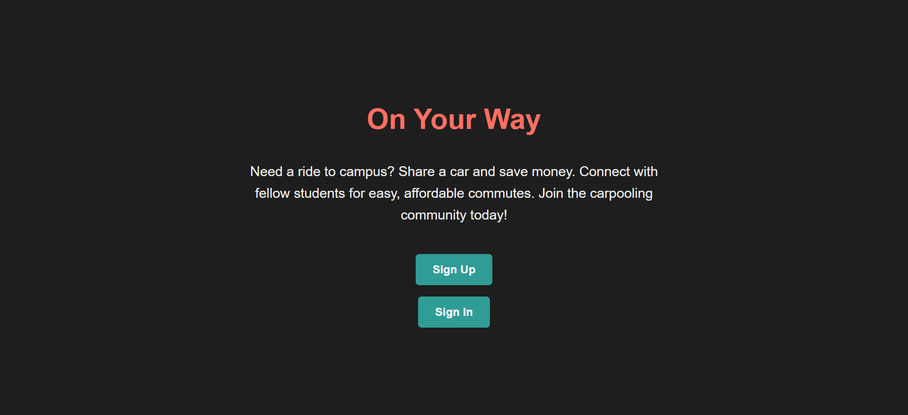
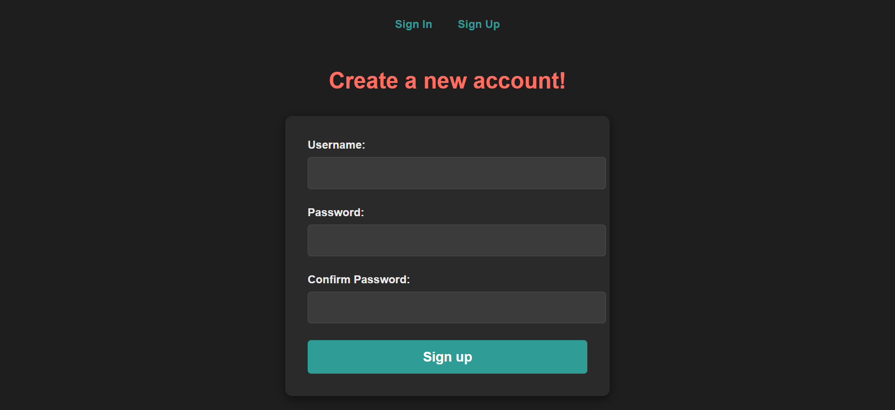
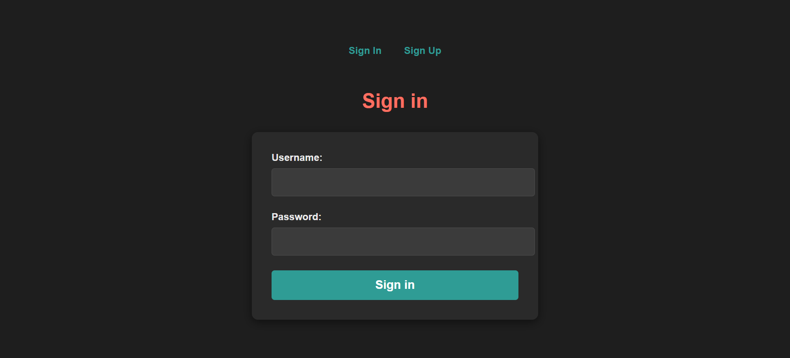
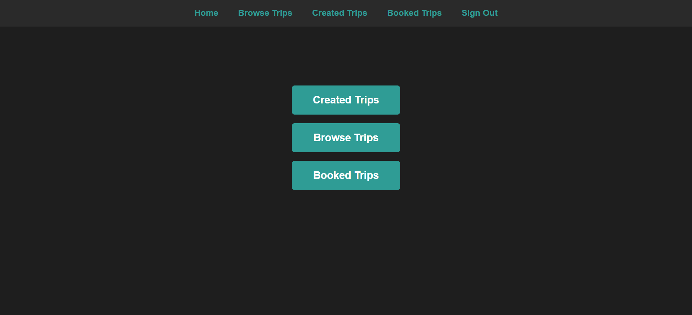
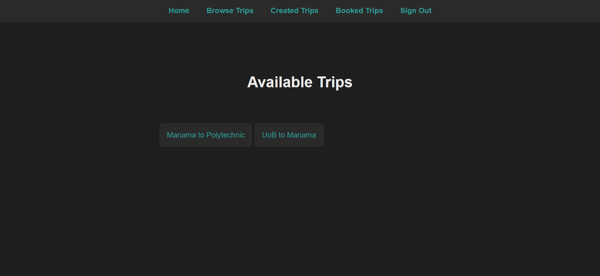
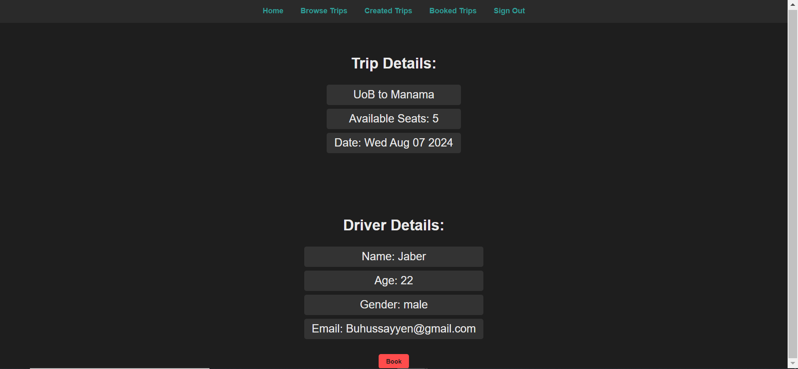
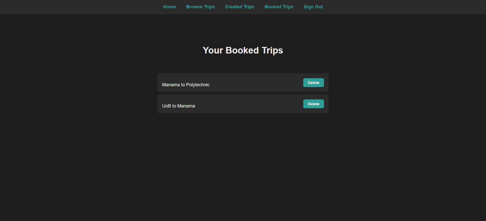
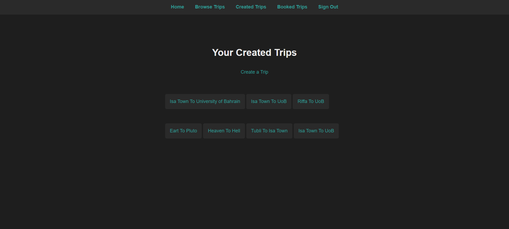
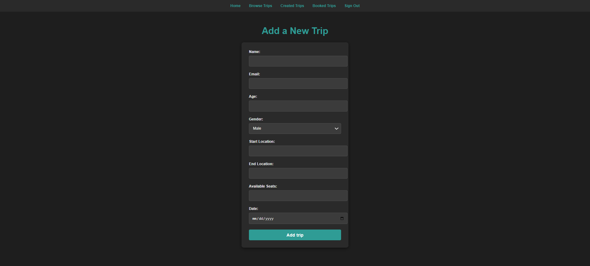
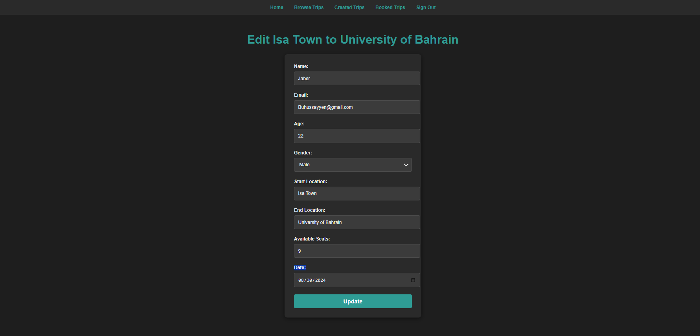

# On Your Way - Carpooling Application

**Date:** 2024-08-01

**By:** Jaber Buhusain

## Description
On Your Way is a carpooling application that allows users to create, browse, and book trips. The application is designed to help users share rides, help drivers to make money, and those who don't have a car get cheaper prices to get to their destination. The platform features a user-friendly interface with a dark theme and consistent design across all pages.

## View my Project Planning in Trello: 
[Project Planning](https://trello.com/b/Clqy38fv/car-pooling)

## Getting Started
To get started with the On Your Way carpooling application:

### 1. Clone the repository:
```bash
git clone https://github.com/stoictylerdurden/onYourWay.git
```
### 2. Install dependencies:
```bash
cd onYourWay
npm install

```
### 3. Set up environment variables:
```javascript
MONGO_URI=your_mongodb_connection_string
SECRET=your_secret_key
```
### 4. Run the application:
```bash
npm start
```

### 5. Access the application:
- Sign up or sign in to your account.
- Browse available trips, create new trips, or view your booked trips.

## 


## Technologies Used
- Node.js
- Express.js
- MongoDB
- HTML
- CSS
- JavaScript


## Screenshots











## Future Updates
1. Implement an email notification system that alerts the driver when a client books their trip.
2. Enhance the UI/UX for a more intuitive and visually appealing user experience.
3. Integrate a payment gateway for secure and easy transaction handling.
